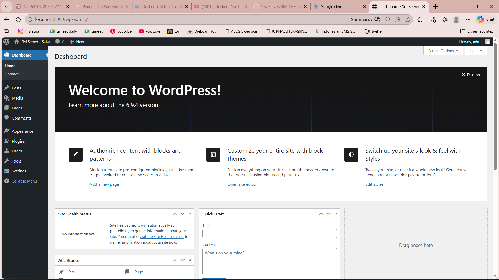
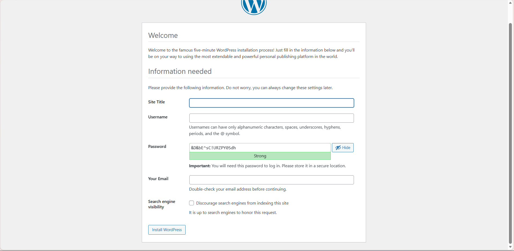
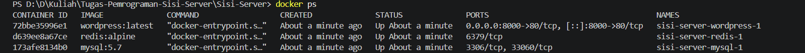
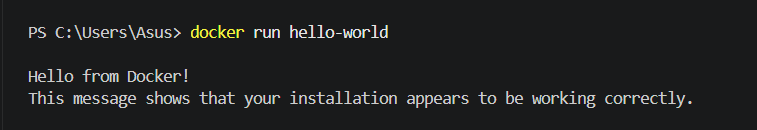

Salsa Dharma Arindina - A11.2023.15246
Deskripsi tugas
    Proyek ini merupakan implementasi Sisi Server / Docker
Cara menjalankan project
Screenshot hasil

Kenapa perlu volume untuk MySQL?
Tanpa volume, data database akan hilang saat container dihapus (tidak persistent). Volume memetakan folder di dalam container ke penyimpanan lokal komputer kita, sehingga data tetap aman meskipun container di-restart atau di-update.

Apa fungsi depends_on?
Fungsinya untuk mengatur urutan jalannya container. Dalam hal ini, WordPress harus menunggu MySQL dan Redis jalan terlebih dahulu karena WordPress tidak bisa berfungsi tanpa koneksi database.

Bagaimana cara WordPress container connect ke MySQL?
Lewat jaringan internal Docker (Docker Network). WordPress memanggil MySQL menggunakan nama service-nya yaitu mysql (sebagai hostname) bukan menggunakan alamat IP.

Apa keuntungan pakai Redis untuk WordPress?
Sebagai Object Cache. Redis menyimpan hasil query database yang sering dipanggil ke dalam RAM (memory), sehingga website WordPress jadi jauh lebih cepat karena tidak perlu terus-menerus membebani database MySQL.
